# QA 검증 관리 시스템 — 요구사항 및 기능사양서

작성 기준: 2026-09-09 · 운영 서버 `10.13.0.222` 반영 완료분 · 화면 스크린샷은 실제 화면을
캡처한 것

---

## 0. 이 문서를 읽는 법

이 문서는 **화면에서 실제로 무엇을 보고, 무엇을 누르면 어떤 결과가 나오는지**를
기준으로 정리했다. 내부 구현 방식(코드 구조, 통신 방식 등)은 다루지 않는다 — 다만
사용자가 화면에서 체감하는 차이(예: 진행 상황이 실시간으로 바뀌는지, 저장 후 새로고침이
필요한지)는 남겨 두었다.

### 0.1 사양번호 체계

모든 항목에 **`대분류-중분류`** 형식의 사양번호를 붙였다. 예: `01-03`.

- **대분류(2자리)** — 시스템 화면(탭) 단위. `00`은 특정 탭에 속하지 않는 **공통 기반**이고,
  `01`~`07`은 실제 메뉴 탭 하나씩에 대응한다.
- **중분류(2자리)** — **화면 하나**. 그 화면의 진입 경로·화면 구성·버튼과 결과·표시
  데이터·조건에 따라 달라지는 표시를 전부 이 번호 하나 아래에 모아서 정리했다. 화면
  안에 탭이나 섹션이 여러 개 있으면(예: 분석 상세 화면의 6개 탭) 같은 번호 안에서
  `####` 소제목으로 구분했다.

**"01-03 을 이렇게 바꿔줘", "04-01 에 이 버튼을 추가해줘"** 처럼 사양번호로 지목하면 된다.

### 0.2 상태 기호

| 기호 | 뜻 |
|---|---|
| ✅ | 구현되어 운영 서버에서 동작 |
| ◐ | 일부만 구현 (무엇이 빠졌는지 항목에 적음) |
| ○ | 미구현 — 요구하면 만들 수 있음 |
| ✋ | **의도적으로 하지 않음** — 이유가 항목에 있음. 뒤집으려면 그 이유를 함께 봐야 함 |

### 0.3 스크린샷에 대해

이 문서의 스크린샷은 목업이 아니라 실제 화면을 그대로 캡처한 것이다. 다만 로컬에 있는
데이터 그대로 찍었으므로, 일부 화면(QA Agent 분석 상세 등)은 예시로 고른 분석 건이 하필
결과가 빈약해 보일 수 있다. **화면 레이아웃과 구성 요소를 확인하는 용도**로 보고, 실제
값(건수·상태)은 운영 서버의 실제 데이터로 다시 확인해야 한다. 데이터가 아예 없어 캡처가
불가능한 화면은 그 항목에 사유를 적어 두었다.

### 0.4 대분류 목록

| 번호 | 대분류 | 비고 |
|---|---|---|
| 00 | 공통 기반 | 배경·범위·시스템구성·공통요구사항 (화면 없음) |
| 01 | QA Agent | `/qa-agent` — Issue 기반 Regression 분석, 5개 화면 |
| 02 | Regression 영향 분석 | `/impact-analyzer` — 5개 화면 |
| 03 | 매뉴얼 개정 검증 | `/manual-review` — 3개 화면 |
| 04 | Knowledge 관리 | `/knowledge` — 3개 화면 |
| 05 | 비용 대시보드 | `/cost-dashboard` — 2개 화면 |
| 06 | QA Manual Hub | `/manual-hub` — 하위 서비스(별도 시스템) |
| 07 | 운영 | 배포·감시·백업 (화면 없음) |

---

## 00. 공통 기반

화면이 아니라 전체 시스템에 걸친 배경·제약·정책이다. 각 항목은 특정 화면이 아니라
여러 화면(01~06)이 공유하는 동작을 규정한다.

### 00-01 배경과 목적

**풀려는 문제.** SW 가 바뀔 때마다 QA 는 **"어떤 Test Case 를 다시 검증해야 하는가"** 를
판단한다. 지금은 사람이 사양서·매뉴얼·기존 TC 를 뒤져서 판단하므로 두 방향으로 틀린다 —
**누락**(변경과 무관해 보이지만 실제로 영향받는 TC 를 빠뜨림, 상태 전이·저장/재시작·권한·
연동 경로에서 특히 자주)과 **과잉**(확신이 없어 필요 이상으로 넓게 잡아 검증 시간이 늘어남).
판단 근거(사양서·매뉴얼·TC)는 이미 문서로 존재한다. 사람이 그것을 매번 다시 찾는 것이
비용이다.

**보안 원칙 — ✋.** 가장 쉬운 해법은 사양서·매뉴얼 전체를 AI 서비스에 올리고 물어보는
것이다. **그렇게 하지 않는다.** 제품 사양서와 매뉴얼은 사내 자산이고, 전체를 외부로
올리는 것 자체가 문제다. 그래서 이 시스템은 문서를 사내 서버에만 두고, **필요한 부분만
추려 요약한 뒤** 그 조각만 AI 에게 보낸다. 실측(VXvue Issue 1건 기준): 사내에 있는 원문
전체 2.11MB 중 실제 외부로 나간 양은 30,207자 — **1.37%**, AI 호출은 1회.

**시스템 목표.** ① 변경 1건에 대해 재검증 대상 TC 를 근거와 함께 제시한다 ② 근거 없는
판단을 내놓지 않는다 — 모르면 "모른다"고 말한다 ③ 최종 판단과 승인은 사람이 한다
④ 제품이 늘어도 새로 개발하지 않고 설정만 추가해 확장한다.

### 00-02 범위

| | |
|---|---|
| 대상 제품 | VXvue, Bellalun Viewer (설정 추가만으로 확장 가능) |
| 사용자 | QA 파트 약 5명 |
| 운영 서버 | `10.13.0.222` (사내망 전용) |
| 규칙 기준 | `[QA 작성 규칙] VXvue TC 설계 및 자체검토 가이드 Rev1.12` |

**범위 밖 — ✋**: 자동 승인(규칙 §55 가 8가지 자동 확정을 금지, 이 시스템은 초안만 만든다),
테스트 자동 실행(TC 를 고르는 것까지가 범위), Polarion 직접 쓰기(읽기만 한다).

### 00-03 시스템 구성

```
   담당자 PC                                  운영 서버 (사내망 전용)
   ─────────────────                        ──────────────────────────
   지식 폴더 (사양서·매뉴얼·TC·규칙)   ──업로드──▶  ① 정문 (웹 접속 주소)
   ALM 크롤러 결과                    ──업로드──▶     │
   Polarion Issue 내보내기            ──첨부────▶     ├─▶ ② 핵심 앱 (QA Agent·영향분석·매뉴얼검증·Knowledge·비용대시보드)
   작업 스케줄러 (주 1회)                            │
                                                     └─▶ ③ QA Manual Hub (매뉴얼 서버)
                                              ② ──────▶ AI 서비스 (요약된 조각만)
```

- **핵심 앱과 매뉴얼 서버는 서로 독립적이다 — ✅**: 한쪽에 문제가 생겨도 다른 쪽은 계속
  동작한다. 서로 연결되는 지점은 화면의 링크뿐이다.
- **자동 복구 — ✅**: 서버가 재부팅되거나 앱이 죽어도 자동으로 다시 켜진다.
- **재시작 후 작업 정리 — ✅**: 재시작 도중 끊긴 분석은 정리되고, 대기 중이던 분석은
  이어서 처리된다.
- **모든 화면의 공통 레이아웃 — ✅**: `01`~`05` 화면은 공통 상단 헤더(제목·부제·메뉴
  링크)를 공유한다. 홈 화면만 메뉴가 없다. 파일을 올리는 영역은 어느 화면에서나 클릭하거나
  파일을 끌어다 놓는 방식으로 동작하고, 화면에 표시되는 시각은 항상 한국 시간(KST) 기준으로
  보인다.

### 00-04 제품 지식 자산 관리

**제품 확장 — ✅.** 새 제품을 추가할 때 새로 개발하지 않는다. 제품별로 설정 하나만
추가하면 된다.

**파일명 규칙 기반 자동 분류 — ✅.** 파일 이름에 붙은 표기로 사양서·매뉴얼·TC·QA 규칙을
자동으로 구분한다.

| 파일명 | 분류 |
|---|---|
| `(사양서) …`, `…SRS 사양서…`, `…사양서N…` | 사양서 |
| `(매뉴얼) …`, `…Operation Manual…`, `…Service Manual…`, `…Conformance Statement…`, `System Integration Guide…`, `…API Protocol Manual…` | 매뉴얼 |
| `(TC) …`, `…Test Case…`, `…TestCase…`, `…Checklist…` | Test Case |
| `[QA 작성 규칙] …` | QA 규칙 |
| `…지침 프롬프트…` | 지침 프롬프트 |

**최신 리비전 자동 판별 — ✅.** 같은 문서의 여러 버전 중 최신 하나만 고른다 — 날짜
`(260907)`(사양서), 버전 `V1.0.11`/`V1.0.12W1`/`v1.4.4`(매뉴얼), Rev `Rev1.12`(QA 규칙)
같은 표기를 인식한다. 같은 문서가 PDF/Word 원본과 사람이 따로 뽑아둔 텍스트본으로 둘 다
있으면 원본을 우선한다(텍스트본은 갱신을 잊기 쉽다). 문서번호는 리비전 표기와 구분해서
인식하고, 상태 꼬리표(`_확인완료`, `(개정)`)는 문서 구분에서 무시하며, 한국어/영어처럼
언어가 다른 파일은 별개 문서로 본다.

**잘못 등록된 문서 자동 정리 — ✅.** 같은 문서의 확실히 더 오래된 버전은 자동으로 지운다.
**내용이 완전히 같은 파일이 서로 다른 종류로 중복 등록**돼 있으면(실제로 매뉴얼 4건이
사양서로도 등록돼 있었던 사례가 있었다 — 검색에 두 번 잡혀 진짜 사양서를 밀어낸다) 이것도
자동으로 정리한다. 이때 **등록만 지우고 원본 파일은 남긴다** — 잘못 지웠을 때 되돌릴 수
있어야 하기 때문이다. 판단이 애매한 경우는 지우지 않고 보고만 한다. 원본 파일이 이미
사라진 등록은 지운다.

**현재 등록된 제품 (참고)**

| 제품 | 사양서 | 매뉴얼 | TC | 규칙 |
|---|---|---|---|---|
| VXvue | 6 | 5 | 4 | Rev1.12 |
| Bellalun Viewer | 2 | 5 | 4 | 수집됨 |

### 00-05 지식 최신화

담당자가 폴더에 최신본을 두면 서버가 그것을 쓴다 (화면 조작은 `04-01` 참고).

- **업로드 방식 — ✅**: 담당자 PC 에서 서버로 최신 파일을 전송하는 별도 도구를 실행한다.
- **PC 폴더를 서버가 직접 들여다보지 않는 이유 — ✋**: 담당자 PC 가 사내 Wi-Fi 를 쓰고
  외근도 잦아 항상 같은 위치·같은 네트워크에 있지 않다. 서버가 PC 폴더를 직접 참조하는
  방식이었다면, PC 가 네트워크에 없는 주에는 수집 자체가 비어버렸을 것이다. 그래서 PC 가
  서버로 보내는 방식으로 정했다.
- **바뀐 파일만 전송 — ✅**: 서버가 이미 가진 파일과 비교해 새로 바뀐 파일만 보낸다.
  실측: 첫 회 VXvue 106MB → 같은 내용으로 다시 실행하면 0MB.
- **처리 순서 — ✅**: 먼저 서버가 가진 파일 목록을 확인하고, 바뀐 파일만 전송한 뒤,
  마지막에 등록을 확정하고 오래된 파일을 정리한다.
- **정리 규칙 — ✅**: 오래된 버전은 지운다. 파일 하나가 실패해도 나머지 전송은 계속
  진행되고, 실패 목록이 결과에 남는다. 전송 중 파일이 손상되면 서버에 남기지 않는다.
- **자동 실행 — ✅**: 작업 스케줄러로 주 1회 자동 실행(VXvue 월 07:30, Bellalun 월 07:45).
  VXvue 사양서는 별도의 자동화 도구가 최신본을 읽어 자동으로 등록한다.
- **업로드 실패 알림 — ○**: 지금은 실행 결과 화면에만 표시된다.
- **한글 파일명 복구 — ✅**: 한글 파일명이 시스템 이동 중 깨지는 경우가 있는데, 이를 자동
  복구한다. 복구가 안 되면 원인을 남기고 넘어간다.

### 00-06 보안

- **원문 비전송 원칙 — ✅**: 원본 문서 전체를 외부로 보내지 않는다(`00-01` 참고 — 실측
  1.37%).
- **개인정보·사내 식별자 가리기 — ✅**: 외부로 나가는 문자열에서 개인정보·사내 정보를
  가린다 — 예: 네트워크 경로, PC 경로, 이메일, 환자 ID·이름, 병원명, 고객명, 시리얼번호,
  계정, 비밀정보. 지우지 않고 자리표로 바꾼다(예: `[환자ID]`). QA 판단에 꼭 필요한
  식별자(SRS/Issue 번호, DICOM Tag, Command 번호, 버전, 에러코드)는 가리지 않는다. 감사
  화면(`01-03`, `02-03`)에서는 실제로 전송된 내용을 그대로 볼 수 있다. 이 가리기 기능은
  설정에서 끌 수 있지만 기본은 켜져 있다. 가리는 규칙을 화면에서 추가·수정하는 기능은
  — ○(지금은 개발 작업이 필요).
- **접근 통제 — ◐**: 사내망 안에서만 접속할 수 있고, 보안 연결(HTTPS)을 쓴다. **사용자
  로그인이 없다 — ○.** 사내망 안이면 누구나 들어올 수 있고, QA 승인 기록에 "누가"가
  남지 않는다(`부록 B` 참고). 업로드하는 파일 이름은 그대로 신뢰하지 않고, 이상한 경로가
  섞여 있으면 거절한다. 업로드는 문서 형식(PDF·Word·Excel·텍스트)만, 한 파일 200MB
  까지 허용한다.

### 00-07 비용과 모델 선택

- **비용을 줄이는 설계 — ✅**: 분석 1건에 AI 호출은 1회뿐이다. QA 규칙 전체를 매번 보내는
  대신 그 상황에 맞는 부분만 추려서 보낸다. 같은 입력으로 다시 분석하면 이전 결과를
  그대로 재사용해 추가 비용이 들지 않는다. 하루 누적 사용량이 정해진 한도를 넘으면 새
  분석을 막아 비용이 통제 범위를 벗어나지 않게 한다(이미 실행 중인 분석에는 영향 없다).
- **모델 선택 기준 — ✅ / ✋**: 이 Issue 가 얼마나 복잡한지는 AI 에게 묻지 않고, Issue 에
  적힌 정보(원인이 명시됐는지, 근거 문서가 몇 개인지 등)로 자동 판단해 적절한 등급의
  모델을 고른다. **더 고급 모델(Pro 계열)은 쓰지 않는다 — ✋.** 같은 입력으로 비교해 보니,
  고급 모델은 응답 속도가 훨씬 느리면서도 근거가 하나도 없는데 전부 "이상 없음"으로
  단정하는 등 오히려 위험한 결과를 냈다. 지금 쓰는 모델은 훨씬 빠르고 저렴하면서, 실제로
  근거가 있는 항목만 골라내는 더 신중한 결과를 낸다. 선택한 모델을 계정에서 쓸 수 없게
  되면 기본 모델로 자동 전환하고, 전환됐다는 사실을 기록에 남긴다(조용히 바꾸지 않는다).
- **비용 추정 — ✅ / ◐**: 건당 약 $0.010, 5명이 월 1,000건 분석한다고 가정하면 월 약 $10.
  최신 모델의 공식 단가는 아직 잠정값이라 확인이 필요하다(`부록 B` A-3).
- **오류 메일 알림 — ✅ / ◐**: AI 사용량 한도 초과, 결제 문제, 모델 사용 불가 등 시스템이
  스스로 해결할 수 없는 문제가 생기면 담당자에게 메일로 알린다. 같은 문제로 메일이 반복해서
  가지 않도록 일정 시간 간격을 둔다. 메일 발송에 실패해도 분석 자체는 실패하지 않는다.
  메일 내용도 개인정보 가리기를 거친다. **메일 발송 계정 설정이 아직 안 되어 있다 — ◐**
  (`부록 B` A-1). 알림 대상을 다른 상황(분석 실패, 동기화 실패 등)으로 넓히는 것 — ○.

### 00-08 추적성

**"왜 그렇게 판단했는지" 되짚을 수 있어야 한다 — ✅.** 분석마다 입력했던 내용, 찾아낸
근거, 조건 통과 여부와 이유, 실제로 AI 에게 전달된 내용, 가려진 개인정보 요약, 사용한
모델과 비용, AI 의 응답 원문을 전부 남긴다 — 이 전부가 `01-03`/`02-03` 상세 화면의
"AI 요청 기록"에서 그대로 보인다. 근거 없는 판정은 신뢰도가 낮게 표시된다. 진행 상황은
화면에서 확인할 수 있다(기능에 따라 화면이 자동으로 계속 갱신되거나, 완료 후 새로고침이
필요할 수 있다 — 각 화면 항목에 표시). 지식 문서를 언제·무엇을·어떤 결과로 업데이트했는지
이력도 남는다.

### 00-09 비기능요구사항

| 항목 | 현재 | 상태 |
|---|---|---|
| 분석 1건 소요 | 약 10초(AI 응답) + 검색 시간 | ✅ |
| 동시 분석 | 2건까지 (초과하면 잠시 후 다시 시도해야 함) | ✅ |
| 분석 1건 비용 | 약 $0.010 | ✅ |
| 외부 전송량 | 원문의 1.37% | ✅ |
| 테스트 통과 | 625건(로컬) / 620건(서버) | ✅ |
| 지식 전송량 | 첫 회 190MB, 이후 변경분만 | ✅ |
| 가용성 | 단일 서버, 장애 시 자동 재시작 | ◐ |
| 동시 사용자 | 미측정(5명 상정) | ◐ |

### 00-10 무엇을 기록해 두는가

시스템이 오래 보관하는 정보는 다음과 같다.

| 기록 | 내용 |
|---|---|
| 제품과 버전 | 등록된 제품 목록과 각 제품의 버전 |
| 문서 | 등록된 사양서·매뉴얼·Test Case (분석의 근거가 되는 원천) |
| 분석 이력 | QA Agent·Regression 영향 분석 실행 기록 |
| 정확도 평가 | QA 가 확정한 정답 TC 와 그에 따른 정확도 수치 |
| QA 승인/반려 기록 | 누가 언제 무엇을 승인·반려했는지 |
| AI 응답 재사용 기록 | 같은 입력에 대해 재사용한 이전 응답 |
| 동기화 이력 | 지식 폴더 수집이 언제·어떤 결과로 실행됐는지 |
| 매뉴얼 개정 검증 기록 | 개정 검증 이력, 변경 항목, 코멘트, 다른 매뉴얼 영향 |
| 알림 발송 이력 | 메일 알림이 언제 발송됐는지(반복 발송 방지 판단용) |

문서 원본과 등록 정보는 제품별로 구분해 보관되며, 등록만 지워도 원본 파일은 남는 경우가
많다(`00-04` 참고).

### 00-11 외부 인터페이스

| 대상 | 방향 | 방식 |
|---|---|---|
| AI 서비스(Gemini) | 나감 | 보안 연결, 요약된 조각만, 개인정보 가린 뒤 전송 |
| ALM 사양서 자동 수집 도구 | 들어옴 | 그 결과물을 읽기만 함(해당 도구 자체는 건드리지 않음) |
| Polarion Issue 내보내기 도구 | 들어옴 | 내보낸 Issue 파일을 읽기만 함 |
| QA Manual Hub | 양방향 | 화면 간 연동 |
| 메일 서버 | 나감 | 운영 알림 발송 |

---

## 01. QA Agent

`/qa-agent` · **이 시스템의 핵심** · Polarion Issue 하나를 받아 QA 규칙에 따라 분석하고,
재검증할 TC 와 Regression 범위를 근거와 함께 제시한다. 5개 화면으로 구성된다.

### 01-01 분석 실행 화면

| | |
|---|---|
| 화면 주소 | `/qa-agent` |
| 화면 제목 | "Issue 기반 검증 범위 분석" |

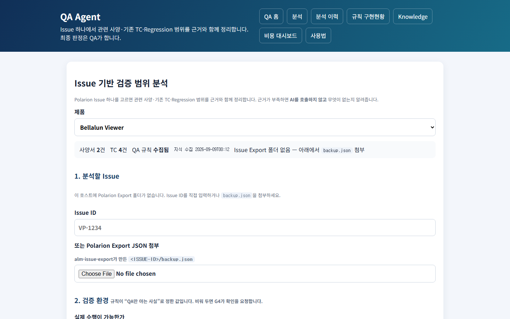

등록된 제품이 하나도 없으면 폼 대신 "등록된 제품이 없습니다. Knowledge에서 제품과
사양서·TC를 먼저 등록하세요." 안내만 나온다. 제품이 있으면 분석을 신청하는 폼이 3구획으로
표시된다.

- **제품 선택** — 제품을 바꾸면 화면이 그 제품 기준으로 다시 표시되고, 상단에 **준비상태
  요약**이 뜬다 — 사양서 건수, TC 건수, QA 규칙 수집 여부(수집되지 않았으면 빨간색으로
  강조되고 "이 제품의 QA 규칙 문서가 없어 분석이 진행되지 않습니다" 경고), 지식 수집
  시각, Issue 목록을 바로 선택할 수 있는지 여부.
- **"1. 분석할 Issue"** — Issue 목록에서 고르거나, Issue 번호를 직접 입력하거나, Polarion
  에서 내보낸 파일을 첨부한다.
- **"2. 검증 환경"** — QA 만 아는 사실이라 사람이 답해야 하는 항목이다. 실제 수행 가능
  여부 / Test Data 준비 여부 / X-ray Exposure 가능 여부 / Dose Table 제공 여부 —
  각 예/아니오/모름 중 선택. 확보한 관찰 수단·이 검증에 반드시 필요한 관찰 수단(UI 화면/
  제품 로그/API·WebSocket/DB/실장비/DICOM 수신 장비 중 체크). 환경 메모(자유 텍스트).
- **"3. 조사 범위와 초안 허용"** — 조사 범위를 제한하는 메모, "정보가 부족해도 초안으로
  작성" 여부.

**버튼과 결과**

| 버튼 | 결과 |
|---|---|
| 분석 실행 | Issue 도 파일도 고르지 않았으면 안내 메시지가 뜨고 진행되지 않는다. 조건이 맞으면 화면 아래에 진행 상황 패널이 나타난다 |

제출 후에는 진행 상황이 화면에서 **자동으로 계속 갱신**되며(새로고침 불필요), 아래 단계가
순서대로 표시된다.

| # | 화면에 표시되는 단계 |
|---|---|
| 1 | Issue 구조화 |
| 2 | 지식 문서 로드 |
| 3 | QA 규칙 로드 |
| 4 | 근거 검색 |
| 5 | 조건 확인 (여기서 조건이 부족하면 분석이 멈추고 AI 는 호출되지 않는다) |
| 6 | AI 분석 |
| 7 | 결과 검증 |
| 8 | 최종 조건 확인 |

완료되면 자동으로 `01-03` 분석 상세 화면으로 넘어간다. 실패하면 진행바가 빨갛게 바뀌고
오류 메시지가 표시된다.

조건 확인 기준을 화면에서 직접 조정하는 기능 — ○(지금은 별도 작업 필요). 여러 Issue 를
한 번에 분석하는 기능 — ○(지금은 1건씩).

### 01-02 분석 이력 화면

| | |
|---|---|
| 화면 주소 | `/qa-agent/analyses` |
| 화면 제목 | "QA Agent 분석 이력" |

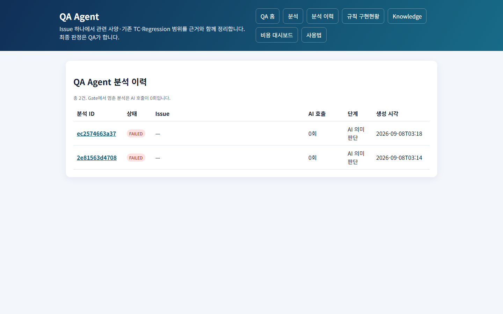

상단에 "총 N건. 조건 확인에서 멈춘 분석은 AI 호출이 0회입니다."라는 안내가 있다. 표에는
분석 ID(누르면 상세 화면으로 이동) / 상태 배지(조건 확인에서 막힌 경우 "조건 미충족"
표시 추가) / Issue 번호 / AI 호출 여부 / 진행 단계 / 생성 시각이 나온다. 이력이 없으면
"아직 분석이 없습니다. 새 분석을 실행하세요." 안내와 `01-01` 로 가는 링크가 뜬다. 목록이
길면 페이지를 넘기는 링크가 아래에 나온다.

### 01-03 분석 상세 화면

| | |
|---|---|
| 화면 주소 | `/qa-agent/analyses/{분석 ID}` |
| 화면 제목 | Issue 번호 |

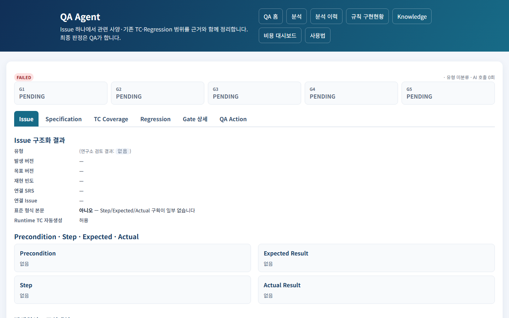

이 시스템에서 **정보가 가장 많이 모여 있는 화면**이다. 상단 요약(상태 배지, 제품명·
Issue 유형·AI 호출 여부·소요 시간)과 그 아래 **조건 확인 카드**, **6개 탭**으로 구성된다.

**조건 확인 카드.** 5가지 조건(G1~G5)을 카드로 보여주고, 각각 통과/보완 필요/입력 필요/
막힘/대기 중 하나의 상태로 표시된다. 조건이 막히면 "진행하지 못한 이유" 안내와 함께
무엇을 보완해야 하는지 알려준다.

| 조건 | 확인하는 것 | 확인 시점 |
|---|---|---|
| G1 | Issue·문서·TC·버전 정보가 충분한가 | AI 분석 전 |
| G2 | 공식 사양에서 근거를 찾았는가 | AI 분석 전 |
| G3 | 기존 TC 가 원인을 실제로 다루는가 | AI 분석 후 |
| G4 | 실제로 검증을 수행할 수 있는 상황인가 | AI 분석 전 |
| G5 | Issue·사양·TC·기대 결과가 서로 모순되지 않는가 | AI 분석 후 |

이 중 G1·G2·G4 가 하나라도 막히면 **AI 분석 자체가 진행되지 않는다** — 근거 없이 물어봐야
근거 없는 답만 나오기 때문이다.

#### Issue 탭

Issue 유형, 발생/목표 버전, 재현 빈도, 연결된 SRS·Issue, Issue 내용이 정해진 형식을
따랐는지 여부가 표시된다. Precondition / Step / Expected Result / Actual Result 가 4개
박스로 나뉘어 보인다. AI 가 분석한 원인·수정 대상·변경 전후 내용도 함께 표시된다. 본문에
이미지가 있으면 파일명 목록만 보여주고, 이미지 자체는 AI 가 판정하지 않는다는 안내가
붙는다.

#### Specification 탭

관련 사양이 몇 건 검색됐는지 요약이 뜨고, 사양 관련도 판정마다 카드가 나온다 — 판정
내용, 근거 목록(근거가 없으면 "근거 없음"이라고 표시되고 이 판정만으로는 확정하지 않는다는
안내가 붙는다), 그리고 QA 가 승인·반려를 남기는 영역(아래 "QA Action" 설명 참고).

#### TC Coverage 탭

검토 대상 TC 건수 요약과, TC 마다 판정 카드가 나온다 — TC 번호, 판정(아래 표), 원인
검출 가능 여부, 판정 신뢰도, 판정 사유, 근거 목록. 판정이 "유지"가 아니면 "실제 TC는
자동으로 바뀌지 않으며 QA 승인 후 반영됩니다"라는 안내가 붙는다.

| 판정 |
|---|
| 유지 |
| 경미 수정 |
| 수정 필수 |
| 신규 TC 필요 |
| Issue Link 수정 |
| 사양 확인 필요 |

#### Regression 탭

**8가지 확인 항목은 항상 고정된 순서로 전부 표시**된다 — AI 가 일부를 빠뜨려도 화면에는
8개가 모두 나오고, 각각 "해당/비해당"과 이유가 채워진다.

| 항목 | 뜻 |
|---|---|
| DIRECT | 변경된 기능 자체 |
| STATE | 상태 전환(A→B, B→A, A→B→A), 오류→정상, 연결→해제→재연결 |
| DATA | 캐시·에러코드·목록·환자·검사 정보의 잔존·오염 |
| PERSISTENCE | 저장·재로드·재진입·재시작 후에도 값이 유지되는지 |
| INTEGRATION | DICOM·API·WebSocket·외부 장치 연동 |
| PERMISSION | 계정 권한에 따른 노출·동작 차이 |
| PRIOR_ISSUE | 같은 원인으로 과거에 있었던 Issue 의 재발 |
| GENERATOR | Generator 관련 동작 |

#### Gate 상세 탭

5가지 조건 각각의 상태와, 시스템이 남긴 메모(문제 심각도와 내용)를 보여준다. 응답에서
실제로 존재하지 않는 TC 번호나 근거가 있었다면 여기서 걸러낸 내용을 알려준다. AI 가
"추가로 확인이 필요하다"고 판단한 내용이 있으면 그것도 표시된다.

#### QA Action 탭

이 화면에서 나온 판정 중 QA 승인이 꼭 필요한 항목(실제 TC 변경, SRS 연결 확정, Pass/Fail,
Issue 종료, 새로운 결함 확정, Release 승인)을 요약해서 보여준다. 표에는 구분(사양 관련도/
TC Coverage/Regression) / 대상 / AI 판정 / 근거 유무 / QA 결정(아직 결정 안 됐으면
"미결정")이 나온다.

**QA 승인 방법** — Specification·TC Coverage·Regression 탭의 각 판정 카드마다 QA 가
"승인/거절/수정 후 승인/근거 추가 필요" 중 하나를 고르고 메모를 남길 수 있다. **저장** 을
누르면 화면이 새로고침되며 QA 의 결정이 함께 표시된다 — **AI 의 원래 판정은 지워지지
않고 QA 결정과 나란히 남는다.**

**근거 등급.** 사양 확인 결과를 "기대 결과"의 근거로 쓸 수 있는지는 근거의 출처에 따라
정해진다.

| 등급 | 근거 | 기대 결과 근거로 |
|---|---|---|
| 1 | 이번 요청에서 사용자가 직접 명시한 사양 | 가능 |
| 2 | 실제 수행 절차·캡처·검증 결과 | 가능 |
| 3 | 최신 유효 사양서 | 가능 |
| 4 | 매뉴얼 / 연동 문서 | **가능 (한계선)** |
| 5 | 기존 TC | 불가 |
| 6 | 이전 버전 문서 | 불가 |
| 9 | 연구소 코멘트 | **불가 — 참고용일 뿐** |

**표준 판정 문구.** 모르는 것을 지어내지 않고 정해진 문구 중 하나로 답한다(16종): `문서상
확인되지 않음` · `추가 사양 확인 필요` · `기존 TC에서 확인되지 않음` · `사양 확인 전
Pass/Fail 판정 불가` · `실제 수행 확인 필요` · `검증 범위 제외` · `UI 경로 간 동작
불일치` · `관련 SRS 존재는 확인되나 본문 직접 확인 필요` · `전체 분할 사양서 조사 완료 전
존재 여부 확정 불가` · `취소선/삭제 사양으로 현재 적용 여부 확인 필요` · `별도 API/WebSocket
검증 필요` · `Issue Link 의미 일치 확인 필요` · `Root Cause Coverage 부족` · `문서 수정
확인 대상` · `Runtime TC 불필요`.

**감사(Audit) 정보.** 화면 하단에서 펼쳐 볼 수 있는 영역에서 AI 에게 실제로 전달된 내용과
AI 가 응답한 내용을 그대로 확인할 수 있다(캐시로 재사용된 응답인지도 표시된다). 하단에는
"결과 내려받기", "분석 이력", "새 분석" 링크가 있다.

승인자를 기록에 남기는 기능 — ○(로그인 기능 없음, `00-06` 참고). Polarion 에 결과를
되돌려 쓰는 기능 — ○. 결과를 TC 관리 Excel 에 직접 반영하는 기능 — ○.

### 01-04 규칙 자동화 현황 화면

| | |
|---|---|
| 화면 주소 | `/qa-agent/rules` |
| 화면 제목 | "규칙 구현현황" |

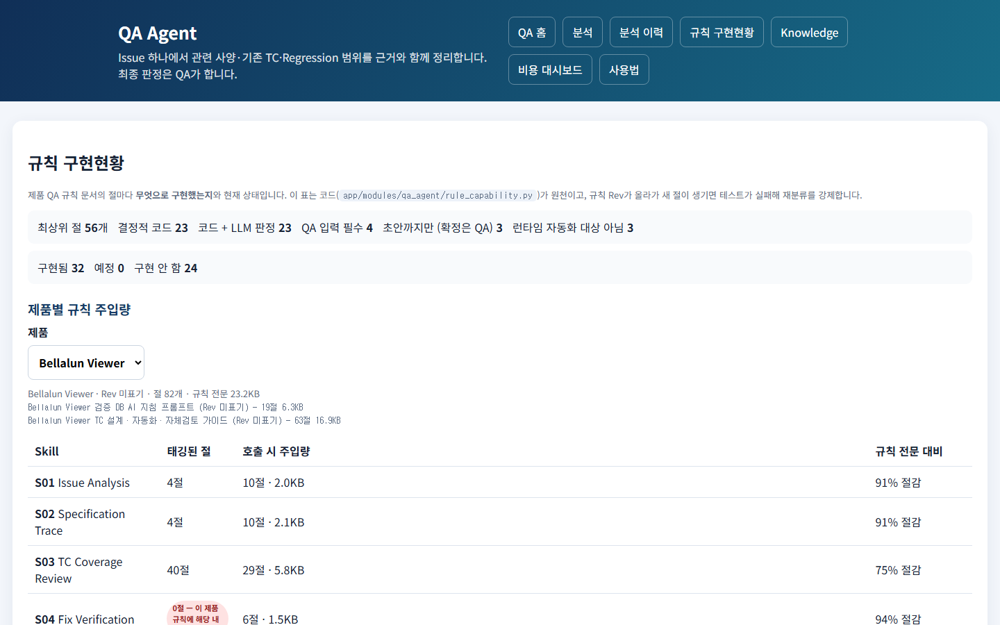

QA 규칙 문서의 각 절이 이 시스템에서 어떻게 다뤄지는지 보여준다. 상단에 전체 절 개수와
구현 방식별·상태별 건수 요약이 있다. **"제품별 규칙 주입량"** — 제품을 고르면 그 제품
규칙에서 각 기능(Skill)마다 실제로 사용된 절이 몇 개인지, 규칙 전체 대비 얼마나 줄여서
사용했는지 보여준다(사용된 절이 0개라고 해서 결함은 아니다 — 그 제품 규칙이 그 주제를
다루지 않는다는 뜻일 수 있다). 규칙 문서가 아직 수집되지 않은 제품은 안내 문구만 나온다.
**"절별 구현 방식"** 표는 제품과 무관하게 규칙의 각 절이 구현됐는지/예정인지/아직인지
보여준다.

이 화면은 조회 전용이며, 현재 규칙 56개 절 중 49개(88%)가 자동화 가능한 것으로 분류돼
있고 그중 33개가 구현돼 있다.

### 01-05 사용법 화면

| | |
|---|---|
| 화면 주소 | `/qa-agent/guide` |
| 화면 제목 | "QA Agent 사용법" |

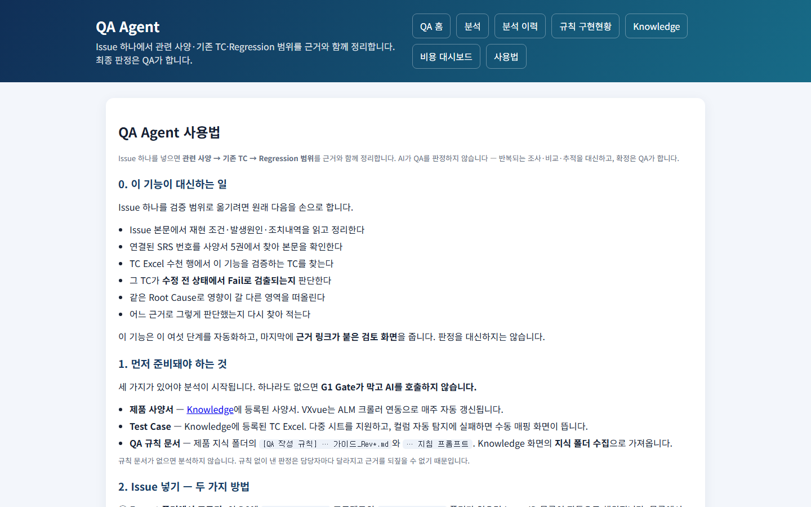

이 기능이 대신하는 일, Issue 를 넣는 방법, 검증 환경을 입력하는 이유, 조건 확인 카드
읽는 법, 탭별로 무엇을 보는지, 감사 정보 확인법, 자주 막히는 경우와 해결법, 다른 기능과의
관계를 안내하는 순수 설명 화면이다.

### 01-06 알려진 한계와 미구현

- **TC 후보가 너무 많다 — ◐**: TC 후보를 40건 정도 검토 대상으로 올리는데, 실제로 관련
  있다고 판정되는 것은 2~3건뿐이다. 단순히 개수를 줄이는 기준만으로는 관련 있는 TC 를
  놓칠 위험이 있어, 실제로 몇 위 안에 관련 TC 가 들어오는지 측정한 뒤 기준을 정해야 한다.
- **의미 기반 검색 — ○**: 지금은 정확히 일치하는 표현과 키워드 유사도로만 검색한다.
  의미 기반 검색을 쓰려면 외부 서비스에 사양서 내용을 보내야 해서 `00-01`(보안 원칙)과
  충돌한다. 지금 방식의 탐지율을 먼저 측정해야 한다.
  - SRS 문서의 세부 메타데이터(SRS 번호, 상위/하위 관계, 연결된 SRS) 자동 추출 — ○
- **조건 확인 기준 화면 조정, 여러 Issue 일괄 분석, 2차 기능 확장(수정 확인 TC 생성,
  Issue 작성 지원, API/DICOM 검증, Generator 검증, Release 검증 범위 산출) — ○**
  (`부록 C` 참고)

---

## 02. Regression 영향 분석

`/impact-analyzer` · Issue 가 아니라 **변경사항 문서**(변경점 정리 문서, Release Note
등)를 받아 재검증 TC 를 추천한다. QA Agent(`01`) 보다 먼저 만들어진 기능으로, 입력이
Polarion 이 아닐 때 쓴다. 5개 화면으로 구성된다.

### 02-01 분석 실행 화면

| | |
|---|---|
| 화면 주소 | `/impact-analyzer` |
| 화면 제목 | "Regression 분석" |

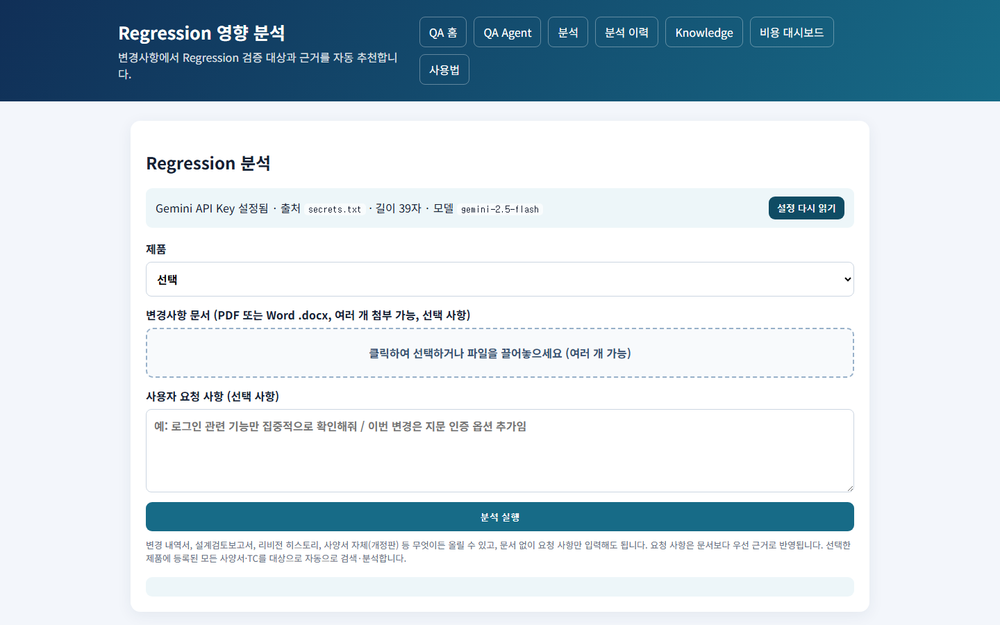

화면 상단에 AI 서비스 연결 상태 배너가 있고, "설정 다시 읽기" 버튼으로 즉시 갱신할 수
있다. 사용량 한도를 넘었으면 배너에 그 사실이 표시된다. 등록된 제품이 없으면 폼 대신
안내문이 뜬다. 있으면 폼 — **제품** 선택 · **변경사항 문서**(PDF/Word, 여러 개 첨부
가능, 선택 사항) · **사용자 요청 사항**(선택 사항). 문서 없이 요청 사항만 입력해도 되고,
선택한 제품에 등록된 모든 사양서·TC 를 자동으로 검토 대상에 넣는다.

**버튼과 결과**

| 버튼 | 결과 |
|---|---|
| 분석 실행 | 파일도 요청사항도 없으면 안내 메시지가 뜨고 진행되지 않는다. 조건이 맞으면 진행 상황 패널이 나타난다 |

제출 후 진행 상황은 **화면에서 자동으로 계속 갱신**된다(새로고침 불필요). 단계는 "입력
문서 분석 → 변경사항 추출 → 최신 사양서 조회 → TC 후보 검색 → AI 영향도 분석 →
Regression TC 선정 → 신규 TC 초안 검증 → 결과 생성" 순으로 표시되고, 완료되면 "완료 ·
추천 N건 · HTML Report 링크 · XLSX 링크"(있으면 "TC 초안" 링크도)가 뜬다.

### 02-02 분석 이력 화면

| | |
|---|---|
| 화면 주소 | `/analyses` |
| 화면 제목 | "분석 이력 (전체 N건)" |

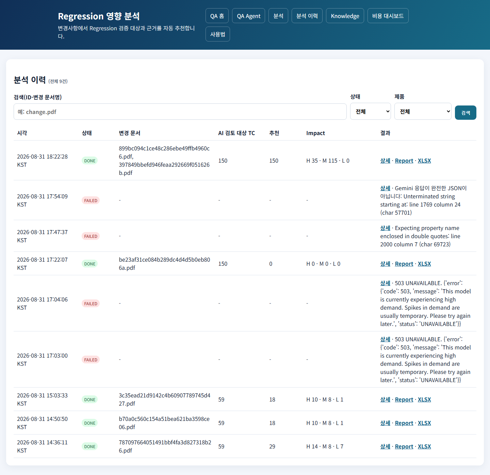

QA Agent 이력과는 분리되어 이 기능의 분석만 표시된다. 검색 상자(분석 ID·변경 문서명),
상태 필터, 제품 필터가 있고, 필터를 적용 중이면 "필터 초기화" 링크가 뜬다. 표에는 시각 /
상태 / 변경 문서 / AI 가 실제로 검토한 TC 수 / 추천 건수 / 영향도(높음·중간·낮음 건수) /
결과(상세·Report·XLSX·TC초안 링크, 실패 시 오류 메시지)가 나온다. 완료된 분석에만
Report·XLSX 링크가 보이고, 신규 TC 초안이 실제로 만들어졌을 때만 그 링크가 보인다.

### 02-03 분석 상세 화면

| | |
|---|---|
| 화면 주소 | `/analyses/{분석 ID}/view` |
| 화면 제목 | "분석 상세 · {ID}" |

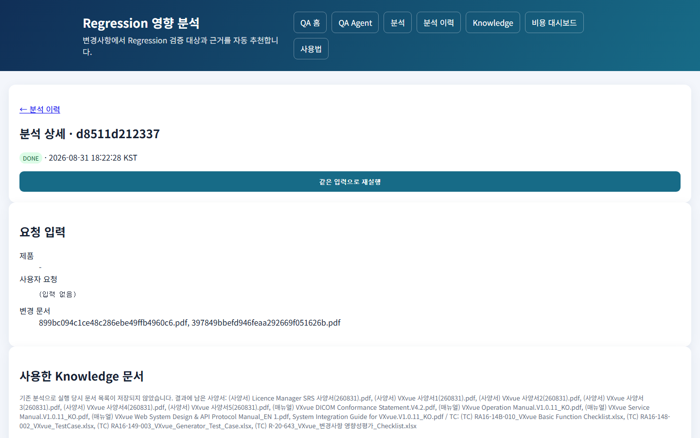

6개(완료 시 7개) 섹션으로 구성된다.

1. **헤더** — 상태, 생성 시각. 완료됐거나 실패한 분석에는 **"같은 입력으로 재실행"** 버튼이
   있어, 누르면 같은 조건으로 새 분석이 시작된다(원본 파일이 이미 삭제됐으면 재실행할 수
   없다).
2. **요청 입력** — 제품, 사용자 요청 원문, 변경 문서 파일명.
3. **사용한 지식 문서** — 이 분석에 실제로 사용된 사양서·TC 목록(문서명·버전·등록 시각).
4. **AI 요청 기록** — 사용한 모델, 이전 결과를 재사용했는지 여부, 그리고 펼쳐서 볼 수 있는
   영역에 실제로 AI 에게 전달된 내용과 AI 의 응답 원문이 있다.
5. **AI 검토 대상 TC 선정 기준** — 어떤 기준으로 TC 후보를 추려 AI 에게 넘겼는지 설명과,
   펼쳐서 볼 수 있는 "선정 순위" 목록.
6. **분석 결과 요약** — 전체 TC 수·검토 대상 수, TC 별 영향도·추천 여부·신뢰도·판단 근거
   표. 완료된 분석에는 HTML Report·XLSX 링크가 있다.
7. **(완료된 분석만) QA 정답 확정 · 정확도 평가** — 실제로 재검증이 필요하다고 QA 가
   확정한 TC 번호를 입력하는 칸과 메모 칸이 있다. **"QA 정답 저장 및 평가"** 버튼을
   누르면 화면이 새로고침되며 이 분석의 Precision/Recall/F1 결과와 그동안 누적된 평균
   결과가 함께 표시된다.

### 02-04 HTML 리포트 화면

| | |
|---|---|
| 화면 주소 | 분석 완료 후 생성되는 결과 보고서 링크 |
| 화면 제목 | "AI Regression Impact Analysis Report" |

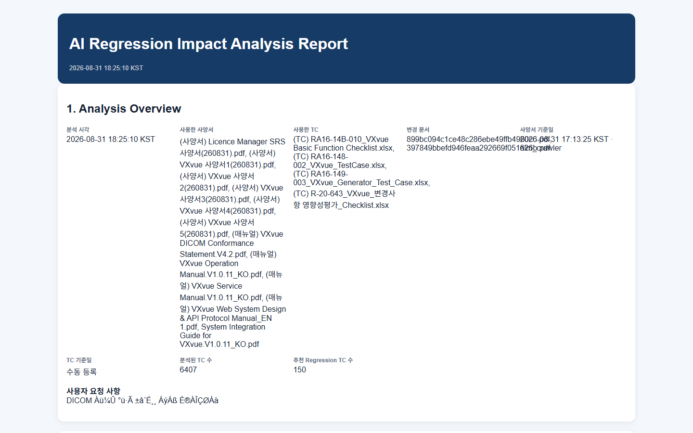

분석이 끝나면 자동으로 만들어지는 열람 전용 보고서다. 6개 섹션 — 분석 개요(시각, 사용한
사양서/TC/변경 문서, 분석된 TC 수, 추천 건수), 변경사항 요약(변경 기능·관련 모듈·수정
유형·재현 방법 등), 영향 분석(전체/검토대상/추천/높음/중간/낮음 건수와 기능별 영향
영역), 추천 Regression TC 목록(TC 번호·영향도·AI 확신도·선정 이유·확인 포인트, "확인
필요"로 강제 표시되는 항목도 있음), 신규 TC 제안(기존 TC 로 다루지 못하는 변경사항이
있을 때만), AI 판단 주의사항("최종 범위는 검증 담당자가 확정해야 한다"는 고정 안내).

### 02-05 사용법 화면

| | |
|---|---|
| 화면 주소 | `/impact-analyzer/guide` |
| 화면 제목 | "Regression 영향 분석 사용법" |

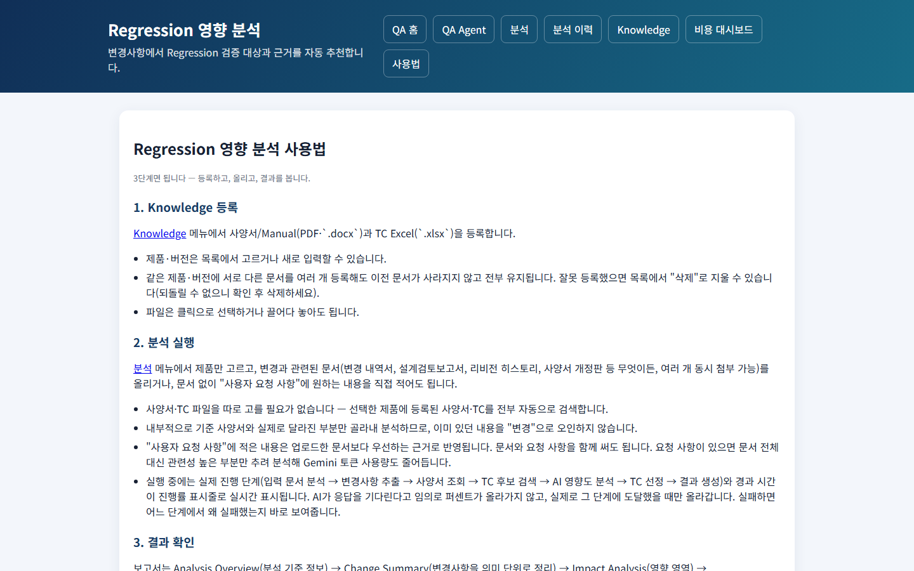

"3단계면 됩니다 — 등록하고, 올리고, 결과를 봅니다."라는 안내로 시작해 ① Knowledge 등록
② 분석 실행(진행 단계가 실제 진행 상황을 그대로 따라간다는 설명) ③ 결과 확인(보고서
섹션 순서, 영향도 값의 의미)을 설명한다. VXvue 사양서 자동 동기화 안내와 비용 관리(호출
1회, 재사용, 하루 사용량 한도) 안내도 있다.

### 02-06 알려진 한계와 미구현

QA Agent(`01`)와 이 기능을 하나로 통합하는 것 — ○(지금은 입력 형태가 달라 별도 화면).

---

## 03. 매뉴얼 개정 검증

`/manual-review` · Word/PDF 매뉴얼의 개정 내용이 사양서와 맞는지 AI 가 1차 검토한다.
사람이 매뉴얼 전체를 사양서와 대조하던 작업을 줄인다. 3개 화면으로 구성된다.

### 03-01 검증 등록·이력 화면

| | |
|---|---|
| 화면 주소 | `/manual-review` |
| 화면 제목 | "매뉴얼 개정 검증" |

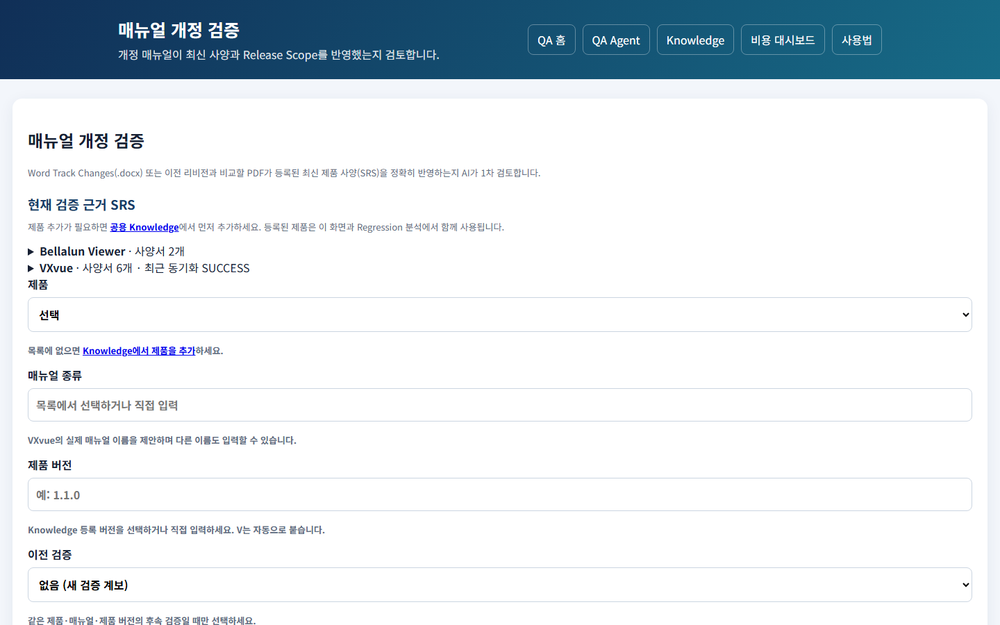

**"현재 검증 근거 SRS" 패널** — 제품별로 펼쳐 보는 목록. 요약줄에 "제품명 · 사양서 N개 ·
최근 동기화 상태"가 나오고, 펼치면 사양서 파일명·버전·등록시각이 보인다. 사양서가 없으면
"등록된 사양서가 없어 SRS 근거를 찾을 수 없습니다."라고 안내한다.

**검증 등록 폼** — 제품 · 매뉴얼 종류(입력하면 이 제품에서 썼던 이름이 자동으로 제안됨) ·
제품 버전(예: "1.1.0" 처럼 입력하면 앞에 V 가 자동으로 붙는다) · **이전 검증**("없음(새
검증 계보)" 또는 기존 검증 중 선택 — 제품·매뉴얼 종류를 고르면 그에 맞는 후보만 보인다) ·
개정 Manual 파일(Word Track Changes 또는 PDF, 필수) · Release Note(선택, 첨부하지 않으면
그 제품에 등록된 최신 문서를 자동으로 사용) · 설계검토보고서(선택, 동일).

**버튼과 결과**

| 버튼 | 결과 |
|---|---|
| 검증 시작 | 필수 항목이 비어 있으면 안내 메시지가 뜬다. 조건이 맞으면 진행률 패널이 나타나고, **화면에서 자동으로 계속 갱신**된다(새로고침 불필요). 완료되면 "완료 · 변경 N건 분석 대상 M건 · 누락 의심 X/Y건 · 결과 보기" 링크가 뜬다(PDF 를 처음 등록한 경우는 "기준 등록 완료 · 다음 검증에서는 이전 검증으로 선택하세요"라고 안내) |

**검증 이력** 표 — 등록 시각 / 제품 / 매뉴얼 / 제품 버전 / 검증 회차 / 상태 / 결과
링크(`03-02`로 이동).

### 03-02 개정 상세 화면

| | |
|---|---|
| 화면 주소 | 검증 이력에서 "결과 보기"를 눌러 들어가는 화면 |
| 화면 제목 | "매뉴얼 개정 검증 결과" |

> 로컬에 아직 완료된 검증 이력이 없어 이 화면은 스크린샷을 캡처하지 못했다. 실제
> 데이터가 쌓이면 다시 캡처해 채워 넣어야 한다.

상단에 제품 · 매뉴얼명 · 검증 회차 · 제품 버전과 "판정 요약: {판정} {건수}건"이 나온다.
원본이 Word 파일이면 **"Word Comment 삽입 DOCX 생성"** 링크가 뜨고, PDF 면 대신 "PDF
변경은 모든 항목에 사람 확인이 필요하며 Word Comment 생성은 지원하지 않습니다."라는
안내가 뜬다.

**아래 항목은 데이터가 있을 때만 화면에 나타난다.**

1. **누락 의심(Release Note/설계검토보고서 대비)** — 있을 때만 표시. 참고용 정보이며
   버튼은 없다.
2. **다른 Manual 영향 확인** — 있을 때만 표시. 대상 매뉴얼명·근거·QA 상태를 보여주고,
   QA 가 "확인 필요/영향 있음/영향 없음" 중 하나를 골라 **확정**할 수 있다. 저장하면
   화면이 새로고침되며 상태가 반영된다.
3. **이전 검증에서 미해결이었던 지적사항** — 있을 때만 표시. 이전 지적사항과 현재 변경을
   참고용으로 짝지어 보여주고, QA 가 "해결됨/미해결/재오픈/QA 판단으로 제외" 중 하나를
   골라 **확정**한다. **이전 지적사항이 자동으로 재사용·재삽입되지는 않는다** — QA 가
   직접 최종 상태를 정하는 구조다.
4. **변경사항(N건)** — 항상 표시. 각 변경 항목마다 종류(추가/삭제/이동 등) 표시, 이미지가
   바뀐 변경이나 PDF 비교로 판정된 항목은 "사람 확인 필요" 표시가 추가된다. 단순 서식
   변경으로 분류된 항목은 그 사실만 표시되고, 실질적인 변경에는 AI 판정(문제없음/보강
   필요/수정 필요/삭제 필요/누락 의심/사양 확인 필요/버전 확인 필요/판단 불가)과 판정
   신뢰도가 함께 표시된다. QA 가 판정을 바꾸면 "QA 재판정" 표시가 추가되고, **AI 의 원래
   판정은 지워지지 않고 QA 재판정과 나란히 남는다.** 변경 내용, 근거(사양서명·항목 등),
   AI 가 제안한 코멘트 문구가 함께 표시된다. 실질적인 변경마다 QA 가 판정을 바꾸고
   메모를 남길 수 있는 영역이 있으며, **저장**을 누르면 화면이 새로고침되며 반영된다.

**"Word Comment 삽입 DOCX 생성" 링크** — 누르면, 원본 Word 파일에 문제가 있다고 판정된
항목마다 해당 문단에 코멘트가 삽입된 새 파일이 즉시 다운로드된다. 코멘트 내용은 AI 가
제안한 문구와 QA 가 남긴 메모를 합친 것이다. 원본의 기존 변경 이력·코멘트는 그대로
보존된다. 코멘트를 넣을 문제 항목이 하나도 없으면 이 기능은 사용할 수 없다.

### 03-03 사용법 화면

| | |
|---|---|
| 화면 주소 | `/manual-review/guide` |
| 화면 제목 | "매뉴얼 개정 검증 사용법" |

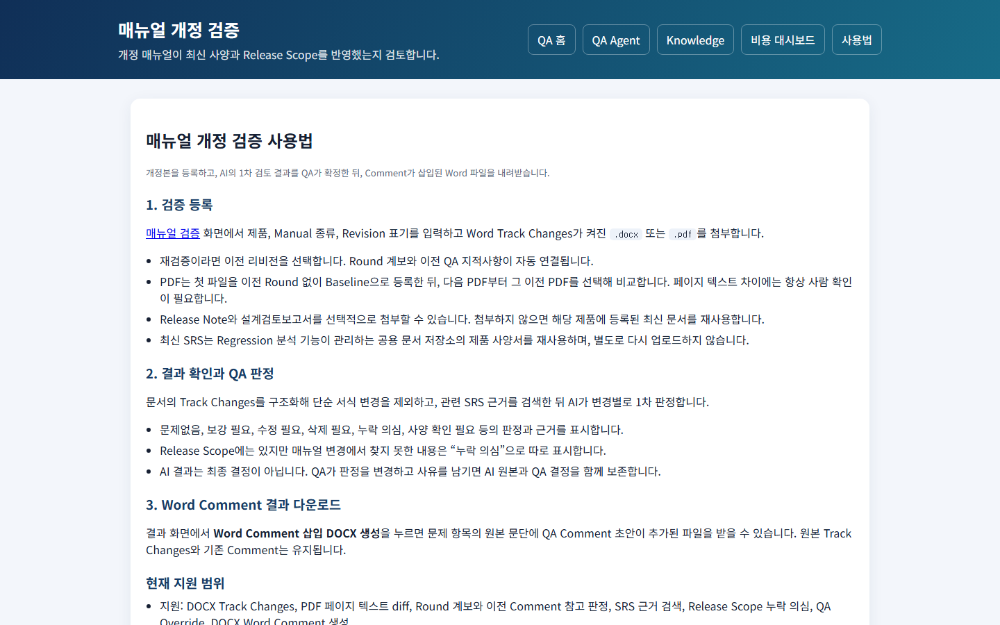

검증 등록 방법, 결과 확인과 QA 판정 방법, Word Comment 다운로드 방법, 현재 지원 범위를
설명하는 정적 안내 화면이다.

> **화면 문구가 실제와 다른 부분 (부록 B 참고)**: 이 화면의 "현재 지원 범위" 문구는 "다른
> Manual 영향 확인" 기능을 "준비 중"이라고 적어 두었지만, 실제로는 `03-02` 화면에 이미
> 있고 동작한다. 다음에 이 화면 문구를 고쳐야 한다.

---

## 04. Knowledge 관리

`/knowledge` · 세 분석 기능(`01`·`02`·`03`)이 함께 쓰는 제품별 사양서·TC·매뉴얼·QA 규칙을
관리한다. 3개 화면으로 구성된다.

### 04-01 Knowledge 메인 화면

| | |
|---|---|
| 화면 주소 | `/knowledge` |
| 화면 제목 | "공용 Knowledge" |

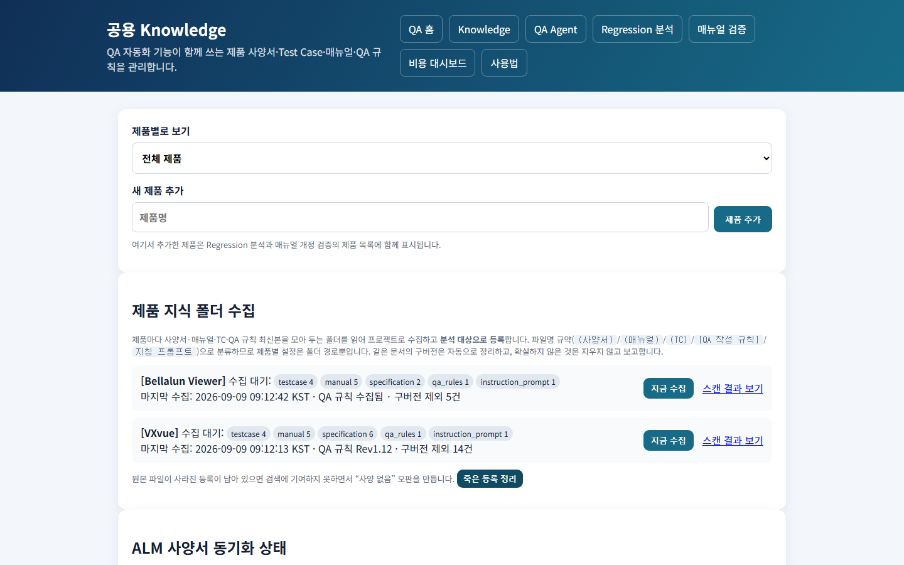

**제품별로 보기** — 제품을 고르면 그 제품의 항목만 화면에 남고 나머지는 가려진다.

**새 제품 추가** — 제품명을 입력하고 **"제품 추가"** 를 누르면 저장되고 화면이 새로고침되며
목록에 나타난다. 여기서 추가한 제품은 `01`·`02`·`03` 의 제품 목록에도 함께 표시된다.

**제품 지식 폴더 수집** — 제품별로 현재 상태를 보여준다 — 폴더 경로가 설정되지 않음 /
설정됐지만 서버가 접근할 수 없음 / 접근 가능(수집 대기 중인 파일 종류별 건수). "마지막
수집" 시각, QA 규칙 수집 여부(안 됐으면 빨간 글씨로 "미수집"), 구버전 정리 건수(있을
때만)가 표시된다. **"지금 수집"** 버튼(접근 가능한 제품에만 표시) — 누르면 즉시 비활성화
되고 "수집 중..."으로 바뀌며, 완료되면 결과가 팝업으로 뜨고 화면이 새로고침된다. **"스캔
결과 보기"** 링크로 상세 내용을 새 창에서 확인할 수 있다. 하단 **"죽은 등록 정리"** 버튼 —
확인 메시지 후 실행하면, 원본 파일이 이미 사라진 등록을 전부 찾아 정리하고 결과를
팝업으로 보여준다(정리된 것이 있으면 화면이 새로고침된다).

**ALM 사양서 동기화 상태** — VXvue 전용 상태 표시. 마지막 동기화 시각과 상태를 보여준다
(자동으로 주 1회 실행됨).

**사양서 / Manual 등록**(왼쪽) — 제품명·버전을 입력하고 PDF/Word 파일을 올린 뒤 **"등록"**
을 누르면 목록에 추가된다. 같은 제품·버전에 서로 다른 문서를 여러 개 등록해도 이전
문서를 대체하지 않는다. 목록의 각 문서마다 **"다운로드"** / **"삭제"**(확인 메시지 후
삭제, 원본 파일도 함께 지워짐) 버튼이 있다.

**Test Case 등록**(오른쪽) — 같은 방식으로 Excel 파일을 등록한다. **자동으로 컬럼을
인식하지 못하면 파일은 지워지지 않고** `04-02` 화면으로 넘어가 직접 지정하게 된다.

**매뉴얼 / Protocol**(지식 폴더 수집으로만 채워짐) — 등록 폼은 없고, 목록과 다운로드/삭제
버튼만 있다.

### 04-02 TC 컬럼 매핑 화면

| | |
|---|---|
| 화면 주소 | TC 등록에서 컬럼을 자동으로 인식하지 못했을 때만 연결되는 화면 |
| 화면 제목 | "TC 컬럼 매핑" |

> 실패한 업로드가 있을 때만 들어오는 화면이라, 지금 데이터로는 재현하지 못해 스크린샷을
> 생략했다.

업로드한 원본 파일명과, 있다면 오류 메시지가 표시된다. 시트를 고르고 "항목명이 적힌
행(헤더 행)" 번호를 지정한 뒤 **"미리보기 갱신"** 을 누르면 그 시트의 내용이 표로
보인다(헤더 행은 강조 표시됨). 그 아래에서 TC ID(필수)·분류·기능명·사전조건·시험절차·
예상결과·결과·비고 각각을 어느 열에 매칭할지 고른다(비슷한 이름의 열은 미리 추천되어
선택돼 있다). **"이 매핑으로 등록"** 을 누르면 그 설정대로 등록되고 `04-01` 화면으로
돌아간다(이후 같은 파일 형식은 이 설정을 기억한다). TC ID 를 매칭하지 않는 등 필수
항목이 빠지면 오류 메시지와 함께 같은 화면이 다시 표시된다.

### 04-03 사용법 화면

| | |
|---|---|
| 화면 주소 | `/knowledge/guide` |
| 화면 제목 | "Knowledge 사용법" |

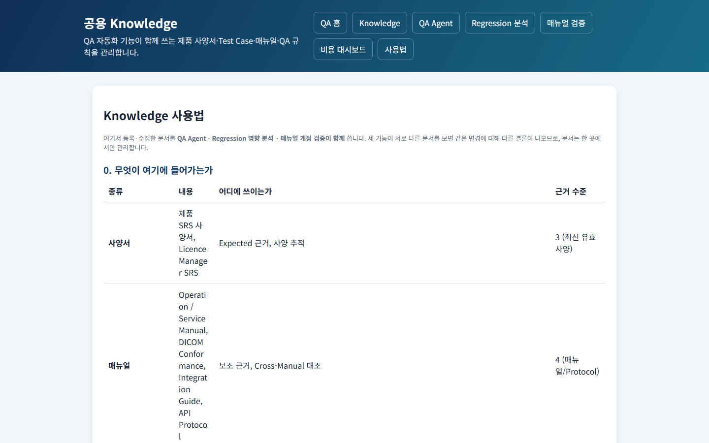

무엇이 여기에 들어가는지(사양서·매뉴얼·TC·QA 규칙의 역할과 근거로서의 신뢰도), 권장
방식(제품 지식 폴더 수집 절차와 파일명 규칙), 서버가 폴더에 접근하지 못할 때의 대안,
개별 파일 수동 등록 방법, TC Excel 이 어떻게 읽히는지, 등록 후 확인 방법, 새 제품 추가
절차, 사내 문서가 어디에 보관되는지(외부로는 발췌만 나간다는 점)를 안내하는 정적 화면이다.

---

## 05. 비용 대시보드

`/cost-dashboard` · AI 호출이 실제로 얼마나 발생했는지, 무엇이 비용을 줄이고 있는지
기능별로 집계한다. 2개 화면으로 구성된다.

### 05-01 비용/캐시 대시보드 화면

| | |
|---|---|
| 화면 주소 | `/cost-dashboard` (최근 7일/30일/90일 중 선택 가능) |
| 화면 제목 | "비용/캐시 대시보드" |

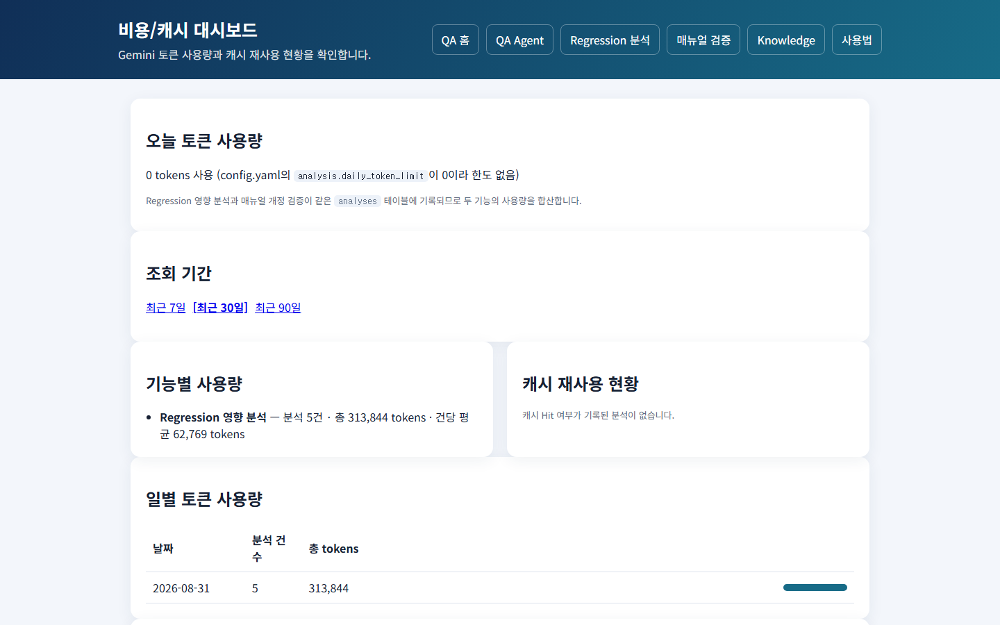

조회 전용 화면이며, 값을 바꾸는 버튼은 없다.

- **오늘 토큰 사용량** — 사용량과 한도, 한도를 넘었는지 여부가 배지로 표시된다.
- **조회 기간** — 최근 7일/30일/90일 중 선택.
- **기능별 사용량** — 기능마다 분석 건수·총 사용량·건당 평균.
- **캐시 재사용 현황** — 같은 입력을 재사용해 실제 호출을 얼마나 줄였는지 비율로 표시.
- **일별 토큰 사용량** — 날짜별 분석 건수와 사용량을 표와 막대로 표시.
- **최근 분석(최대 50건)** — 완료 시각·기능·제품·사용량·캐시 재사용 여부·분석 ID.

사용자별 사용량 집계(로그인 기능 없음) — ○. 예산 초과 예상 시 사전 경고 — ○.

### 05-02 사용법 화면

| | |
|---|---|
| 화면 주소 | `/cost-dashboard/guide` |
| 화면 제목 | "비용 대시보드 사용법" |

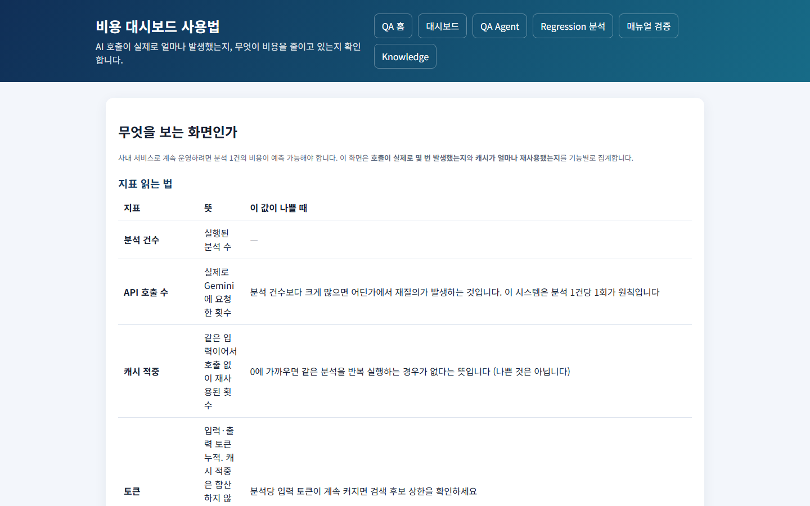

각 지표를 읽는 법, 비용이 줄어드는 이유들, 하루 사용량 한도 설정법, 모델 등급별 단가,
비용이 예상보다 많이 나올 때 확인하는 순서를 안내하는 정적 화면이다.

---

## 06. QA Manual Hub (하위 서비스)

`/manual-hub` — 제품 매뉴얼과 기술문서를 한 곳에 모아 보관하는 별도의 문서관리 시스템이다.
핵심 앱(`01`~`05`)과는 완전히 분리된 별도 시스템이라, 이번 개정에서는 화면 단위 상세
조사를 진행하지 않았다. 화면별 상세 사양이 필요하면 별도로 조사해야 한다. 아래는 기존에
확인된 기능 수준의 요약이다.

- **문서 보관과 이력 — ✅**: 제품 매뉴얼·기술문서를 이전 버전을 지우지 않고 보관한다.
  한 번 등록된 버전은 삭제해도 완전히 사라지지 않고 보관함으로 옮겨진다.
- **핵심 앱과의 연결 — ✅**: 핵심 앱 화면에서 링크로 연결될 뿐, 데이터나 처리 과정을
  공유하지 않는다.
- **계정·백업 — ✅**: 로그인 계정으로 접근하고, 업로드한 사람이 자동으로 기록된다. 매일
  자동으로 백업된다.

---

## 07. 운영

화면은 없고 배포·감시·백업 절차로 구성된다.

- **배포 — ✅**: 로컬 테스트 통과 → 서버 반영 → 재기동 → 정상 동작 확인까지 한 번에
  진행된다. 서버에 이미 있는 운영 데이터·비밀 설정은 배포 때 덮어쓰지 않는다.
- **감시와 백업 — ✅**: 서버 상태를 주기적으로 자동 점검하고, 매일 자동으로 백업한다.
- **운영 상태 확인 — ✅**: 운영 담당자가 서버 상태(데이터 정합성, 실행 중인 작업, 멈춘
  작업)를 확인할 수 있는 별도 화면이 있고, 설정을 앱 재기동 없이 다시 불러올 수 있다.
- **배포 되돌리기(롤백) — ○**: 지금은 이전 버전을 수동으로 다시 올려야 한다. **무중단
  배포 — ○**: 재기동 시 짧게(수 초) 끊긴다.

---

## 부록 A. 화면 목록

| 사양번호 | 화면 주소 | 화면 | 스크린샷 |
|---|---|---|---|
| — | `/` | 홈 (기능 카드) | `images/00-hub.png` |
| 01-01 | `/qa-agent` | QA Agent 분석 실행 | `images/01-01-qa-agent-index.png` |
| 01-02 | `/qa-agent/analyses` | 분석 이력 | `images/01-02-qa-agent-history.png` |
| 01-03 | `/qa-agent/analyses/{id}` | 분석 상세·승인 | `images/01-03-qa-agent-detail.png` |
| 01-04 | `/qa-agent/rules` | 규칙 자동화 현황 | `images/01-04-qa-agent-rules.png` |
| 01-05 | `/qa-agent/guide` | 사용법 | `images/01-05-qa-agent-guide.png` |
| 02-01 | `/impact-analyzer` | Regression 영향 분석 실행 | `images/02-01-impact-analyzer-index.png` |
| 02-02 | `/analyses` | 영향 분석 이력 | `images/02-02-impact-analyzer-history.png` |
| 02-03 | `/analyses/{id}/view` | 영향 분석 상세 | `images/02-03-impact-analyzer-detail.png` |
| 02-04 | (분석 완료 시 생성) | HTML 리포트 | `images/02-05-impact-analyzer-report.png` |
| 02-05 | `/impact-analyzer/guide` | 사용법 | `images/02-04-impact-analyzer-guide.png` |
| 03-01 | `/manual-review` | 매뉴얼 개정 검증 등록·이력 | `images/03-01-manual-review-index.png` |
| 03-02 | (검증 이력에서 진입) | 개정 상세 | (미캡처 — 이력 데이터 없음) |
| 03-03 | `/manual-review/guide` | 사용법 | `images/03-02-manual-review-guide.png` |
| 04-01 | `/knowledge` | 지식 관리 | `images/04-01-knowledge-index.png` |
| 04-02 | (실패 업로드에서 진입) | TC 컬럼 매핑 | (미캡처 — 실패 업로드로만 진입) |
| 04-03 | `/knowledge/guide` | 사용법 | `images/04-03-knowledge-guide.png` |
| 05-01 | `/cost-dashboard` | 비용 | `images/05-01-cost-dashboard.png` |
| 05-02 | `/cost-dashboard/guide` | 사용법 | `images/05-02-cost-dashboard-guide.png` |
| 06 | `/manual-hub/` | QA Manual Hub | (별도 시스템 — 미캡처) |

---

## 부록 B. 남은 결정과 조치

### B.1 사용자 조치가 필요한 것

| | 내용 |
|---|---|
| A-1 | **메일 발송 계정 설정** — 설정하면 알림이 바로 동작 (`00-07`) |
| A-2 | **AI 유료 사용 사내 승인** — 결제는 완료, 승인만 남음 |
| A-3 | **최신 모델 공식 단가 확인** — 현재 잠정값 (`00-07`) |
| A-4 | **GitHub Support 캐시 삭제 요청** — `docs/local/SECURITY_INCIDENT_2026-09-09.md` |
| A-5 | **작업 스케줄러 등록** — 지식 업로드 주 1회 자동화 (`00-05`) |

### B.2 함께 결정해야 하는 것

- **사용자 로그인 + 보안 연결** (`00-06`) — 승인 기록에 "누가"를 남기려면 필요하지만,
  로그인만 먼저 붙이면 오히려 정보가 노출될 위험이 있어 함께 결정해야 한다
- **TC 후보 상한** (`01-06`) — 정확도 평가 데이터가 쌓여야 근거 있게 내릴 수 있다

### B.3 화면 문구가 실제 구현을 못 따라간 사례

- `03-03`(매뉴얼 개정 검증 사용법 화면)이 "다른 Manual 영향 확인"을 "준비 중"이라고 적어
  두었지만 `03-02` 화면에는 이미 구현·동작 중이다. 다음 배포에서 화면 문구를 고쳐야 한다.

### B.4 지금 남아 있는 데이터 이슈

VXvue 의 매뉴얼 문서 한 건이 사양서로 잘못 등록돼 있다. 같은 문서의 최신 버전이 매뉴얼로
따로 등록돼 있어 **옛 버전이 사양서로 검색되는 상태**다. 내용이 달라 자동으로 지우지
않았다 — `04-01`에서 삭제하면 된다.

---

## 부록 C. 요구할 수 있는 확장 후보

이 문서를 보고 무엇을 더 요구할지 정하는 데 쓰라고 정리한다. **우선순위는 정하지 않았다.**

### C.1 QA Agent 기능 확장 (`01-03`)

- 수정된 Issue 의 수정 확인 TC 생성
- Issue 작성 초안·종료 조건 점검
- Command·Tag·WebSocket 단위 검증 항목 도출
- Generator 연동 검증
- 릴리스 단위 검증 범위 산출

### C.2 정확도

- 평가 데이터를 쌓아 TC 후보 상한 최적화 (`01-06`)
- 오판 사례 축적과 재발 방지
- 제품별 검색 가중치 튜닝

### C.3 사용성

- 여러 Issue 일괄 분석 (`01-01`)
- 결과를 TC 관리 Excel 로 직접 반영 (`01-03`)
- 분석 결과 비교 (이전 분석과 무엇이 달라졌나)
- 문서 미리보기·버전 비교 (`04-01`)
- 검색이 무엇을 찾았는지 보여주는 화면

### C.4 연동

- Polarion 쓰기 (승인 결과 반영, `01-03`)
- Redmine·메일 알림 연동
- CI 연동 (빌드마다 자동 분석)

### C.5 운영

- 사용자 로그인·권한 (`00-06`)
- 사용자별 사용량·비용 (`05-01`)
- 무중단 배포, 되돌리기 (`07`)
- 알림 종류 확대 (`00-07`)

---

## 부록 D. 관련 문서

| 문서 | 내용 |
|---|---|
| `docs/QA_AGENT_ARCHITECTURE.md` | QA Agent 내부 구조 |
| `docs/PRODUCT_ONBOARDING.md` | 새 제품 추가 절차 |
| `docs/USER_GUIDE.md` | 사용자 안내 |
| `docs/DEPLOYMENT.md` | 배포 |
| `docs/SERVERS.md` | 서버 3개 역할과 명령 |
| `docs/OPERATIONS.md` | 운영 |
| `docs/POST_DEPLOY_TESTS.md` | 배포 후 테스트 |
| `docs/COST_OPTIMIZATION.md` | 토큰 절약 |
| `docs/EVALUATION.md` | 정확도 평가 |
| `docs/CONTEXT_ENGINEERING.md` | 프롬프트 구성 |
| `NEXT_STEPS.md` · `OPEN_QUESTIONS.md` | 남은 작업·미결정 |
